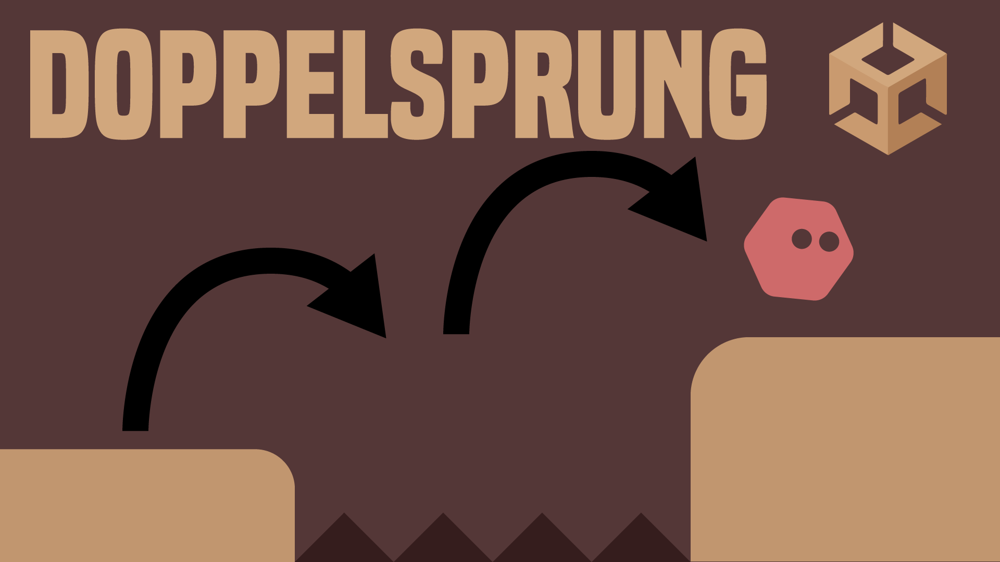

# Doppelsprung in Unity 2D

in diesem Video lernst du, wie du einen Doppelsprung in dein 2D Spiel einbauen kannst. 

- [🎬 YT Tutorial](https://youtu.be/9qV6zMMnAus)
- [💬 Joint unserem Discord Server](https://discord.gg/kusy4JQ4)
- [👍 Abonniert um keine Videos zu verpassen](https://www.youtube.com/@prezipgames)

## Viel Spaß beim Entwickeln!
